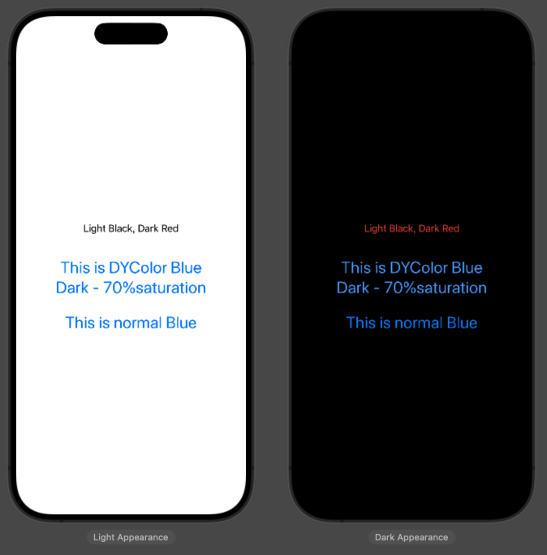

# DYColor
You can easily register and use Dynamic Colors used to counteract Dark Mode as codes.
- UIKit-UIColor & SwiftUI-Color both compatible.
- DYColor contains basic, yet frequently needed, color extensions.

- [](https://swift.org/package-manager/)
[](https://cocoapods.org/pods/YMLogoAlert)
[](https://cocoapods.org/pods/YMLogoAlert)


## Install

### Swift Package Manager
```
https://github.com/bangtori/DYColor.git
```

## Requirements
- iOS 14.0
- Swift 5


## About
### Color Extension 
We provide Color extensions that not only help you implement DYColor, but also help with custom development.<br><br>
**1. hex code init Color**
```swift
Color(hex:"#FFFFFF")
UIColor(hex:"#FFFFFF")
```
You can easily create colors with the familiar HEX color code.<br><br>

**2. Adjusting brightness & saturation**

```swift
// Instance Method
func adjusted(brightness: Double, saturation: Double) -> Color
func adjusted(brightness: Double, saturation: Double) -> UIColor
```
You can adjust the brightness and saturation of the current color.

### DYColor init 
```swift
let swiftUIColor = DYColor(lightColor: Color.black, darkColor: Color.red)
let uiKitColor = DYUIColor(lightColor: UIColor.black, darkColor: UIColor.red)

let swiftUIColor2 = DYColor(lightColor: Color.red)
let uiKitColor2 = DYUIColor(lightColor: UI.red)
```
- As a basic initialization method, you can create a DYColor by entering a light mode color value and a dark mode color value.
- UIKit uses the DYUIColor model, and SwiftUI uses the DYColor model.
- For Initialization that enter only light mode, it automatically assigns a color with 70 percent saturation of the existing color as the dark mode color.

### Get Dynamic Color
```swift
swiftUIColor.dynamicColor
uiKitColor.dynamicColor
```
The dynamicColor property returns the color value set for the screen mode.

### SwiftUI Note
❗️ In SwiftUI, you need to declare a colorScheme at the top of the view you use.
```swift
@Environment(\.colorScheme) var scheme
```


## Example
**SwiftUI**

```swift
// Setting colorsets with extensions
extension DYColor {
    static let color1 = DYColor(lightColor: .black, darkColor: .red) // basic initialization
    static let color2 = DYColor(lightColor: .blue) // lightColor only initialization
}
struct ContentView: View {
    @Environment(\.colorScheme) var scheme // scheme Declarations
    
    var body: some View {
        VStack {
            Text("Light Black, Dark Red")
                .foregroundStyle(DYColor.color1.dynamicColor) // use color1 dynamicColor (DYColor)
                .padding()
            VStack{
                Text("This is DYColor Blue")
                Text("Dark - 70%saturation")
            }
            .font(.title)
            .foregroundStyle(DYColor.color2.dynamicColor) // use color2 dynamicColor (DYColor)
            .padding()
            Text("This is normal Blue")
                .font(.title)
                .foregroundStyle(Color.blue) 
                // use basic Color (SwiftUI - Color)
                // color2 VS basic color saturation in dark mode
        }
        .padding()
    }
}
```

## License

DYColor is available under the MIT license. See the LICENSE file for more info.